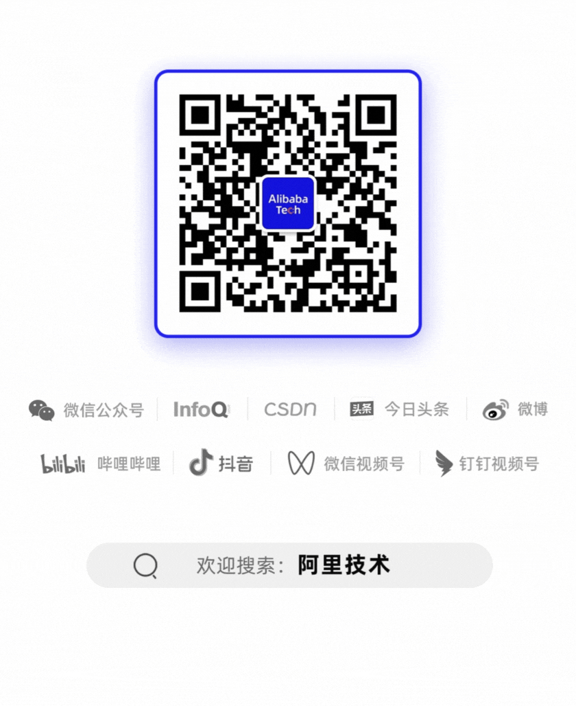

# 大模型可观测1-5-10：发现、定位、恢复的三层能力建设


这是2025年的第105篇文章

（ 本文阅读时间：15分钟 ）

01

**背景**

大模型技术近年快速发展，在各行业均有广泛落地。随着大模型应用的开发与上线，如何构建其端到端可观测体系成为越来越重要的问题。本文基于百炼及相关云产品的能力，结合本人在服务政企客户过程中了解的大模型应用可观测方面的最佳实践，帮助阿里云客户构建大模型应用的可观测能力。

为方便理解，本文还会在每个环节附带一些demo。

02

整体框架

大模型应用的可观测方案，是传统应用可观测方案结合大模型应用特点的进一步扩展。本文仅对大模型应用在可观测领域有区别于传统应用可观测方案的部分进行介绍。结合阿里巴巴在可观测1-5-10的技术体系，大模型应用的可观测方案整体框架如下：


03

核心指标

大模型应用的可观测指标，主要分可用性、性能和业务反馈三大类，主要有：


针对其中可能有疑惑的解释如下：

- 资源水位：和关注数据库的CPU利用率一样，使用大模型也需要关注限流指标QPM和Token的使用率。目前百炼还不支持基于QPM/Token使用率进行告警，所以需要用户在日志中打印使用率指标后进行实时统计，当水位信息接近流控阈值时及时进行限流或联系阿里云进行扩容，避免业务受损。

- 分析维度（应用、功能模块）：打印应用、功能模块是因为在实际场景中，经常会在多个应用或同一个应用内多个模块使用同一个阿里云账号的情况。当此时出现问题时，从阿里云的视角无法快速区分是哪个应用或模块的问题。

- 分析维度（模型、工作空间）：针对具体的云账号，目前百炼支持模型+工作空间维度的限流管控。

- 用户差评率：类似电商关注交易下单数、交易成功率等指标一样，某些业务指标也可以从侧面反馈系统是否出现问题。而大模型应用如果有实时收集用户的反馈，则可以通过差评率体现用户体验是否受损。

04

发现（1）

大模型的可观测领域的发现能力，目前主要还是聚焦在监控告警方面。根据侧重点以及建设方，可以分为业务监控和云产品监控：

1. **业务监控****：**用户可以结合调用百炼时的返回信息，打印自定义日志。结合日志服务、QuickBI、DataV、云监控等云产品构建业务监控大盘和业务自定义告警。

2. **云产品监控****：**以百炼的模型观测&应用观测模块为基础，结合云监控、ARMS产品的能力，为客户提供基础的标准可观测发现能力。

4.1 业务监控

### 日志打印

#### 日志打印规范

大模型应用的日志打印的场景和字段有：

**在调用大模型前：**可以打印大模型调用时间、Prompt、调用模型等信息。不过考虑到Prompt里包含业务数据，请结合需要以及数据安全的要求酌情考虑。如果要打，日志级别建议是Debug。

**在大模型返回后：**根据可观测核心指标的要求推理，需要打印的字段以及其作用主要有：


注：以上的指标仅为日常建议打印的字段。未提及的返回信息在部分场景下也有不可替代的作用，请根据实际需求选择打印。

#### Demo

使用日志格式：

-

```

```

代码中日志打印

-
-
-
-
-
-
-
-
-
-
-
-
-
-
-
-
-
-
-
-
-
-
-
-
-
-
-
-
-
-
-
-
-
-
-
-
-
-
-
-
-
-
-
-
-
-
-
-
-
-
-
-
-

```
long t1 = System.currentTimeMillis();        try {            Generation gen = new Generation();            Message systemMsg = Message.builder()                    .role(Role.SYSTEM.getValue())                    .content("You are a helpful assistant.")                    .build();            Message userMsg = Message.builder()                    .role(Role.USER.getValue())                    .content(prompt)                    .build();            GenerationParam param = GenerationParam.builder()                    .apiKey(System.getenv("DASHSCOPE_API_KEY"))                    .model(model)                    .workspace(workspace)                    .messages(Arrays.asList(systemMsg, userMsg))                    .resultFormat(GenerationParam.ResultFormat.MESSAGE)                    .build();
logger.debug("prompt:{}", prompt);            GenerationResult result = gen.call(param);            long t2 = System.currentTimeMillis();            /** 日志传参             * app 应用名称             * module 模块             * model 模型名称             * workspace 百炼工作空间             * requestId 请求ID             * statusCode 状态码 = https://help.aliyun.com/zh/model-studio/error-code 中的 HTTP 返回码             * time 消耗时间             * inputTokens 输入token数量             * outputTokens 输出token数量             * totalTokens 消耗token数量             * error_code 错误码   = https://help.aliyun.com/zh/model-studio/error-code 中的 错误代码 Code             * error_message 错误信息 = https://help.aliyun.com/zh/model-studio/error-code 中的 错误信息 Message             *             */            logger.info("{},{},{},{},{},{},{},{},{},{},{},{}", app, module, model, workspace, result.getRequestId(), 200, t2 - t1, result.getUsage().getInputTokens(), result.getUsage().getOutputTokens(), result.getUsage().getTotalTokens(), "", "");            logger.debug("result:{}", JSON.toJSONString(result));            return result.getOutput().getChoices().get(0).getMessage().getContent();        } catch (ApiException e) {            long t2 = System.currentTimeMillis();            logger.error("{},{},{},{},{},{},{},{},{},{},{},{}", app, module, model, workspace, e.getStatus().getRequestId(), e.getStatus().getStatusCode(), t2 - t1, 0, 0, 0, e.getStatus().getCode(), e.getStatus().getMessage());            thrownew RuntimeException(e.getLocalizedMessage());        } catch (InputRequiredException e) {            long t2 = System.currentTimeMillis();            logger.error("{},{},{},{},{},{},{},{},{},{},{},{}", app, module, model, workspace, "", "", t2 - t1, 0, 0, 0, "InputRequired", e.getLocalizedMessage());            thrownew RuntimeException(e.getLocalizedMessage());        } catch (NoApiKeyException e) {            long t2 = System.currentTimeMillis();            logger.error("{},{},{},{},{},{},{},{},{},{},{},{}", app, module, model, workspace, "", "", t2 - t1, 0, 0, 0, "NoApiKey", e.getLocalizedMessage());            thrownew RuntimeException(e.getLocalizedMessage());        }
```

即可得到日志结果。正常输出日志样例如下：

-

```
2025-07-0914:23:24.748 INFO  [traceId:41ea65e3-0b4c-4b65-8567-325a6128eddf] [c.a.c.s.i.ChatServiceImpl#chat():67] [http-nio-8080-exec-1] - bailian-log,Chat,qwen-plus,llm-6qtsrlugmu6wanfs,6c958db4-d489-9de8-b5d4-9fc872f24ce2,200,1141,24,9,33,,
```

异常日志如下：

-

```
2025-07-0914:08:26.833 ERROR [traceId:63384a39-bbfe-489b-a290-6635975fc633] [c.a.c.s.i.ChatServiceImpl#chat():72] [http-nio-8080-exec-3] - bailian-log,Chat,qwen-plus,llm-6qtsrlugmu6wanfs,83a0cb5d-07f9-9fd2-9985-1c05b339f5d5,401,38,0,0,0,InvalidApiKey,Invalid API-key provided.
```

###

### 日志采集&存储

日志采集一般选择云产品日志服务（SLS）实现。它是云原生观测与分析平台，一站式提供数据采集、加工、查询与分析、可视化、告警、消费与投递等功能。

针对用户自行打印的日志，日志服务不但支持基于Logtail解析文本格式日志文件后自动上传，也支持用户使用SDK直接写入或使用Log4j/LogBack插件接入。这里都是对产品标准功能的使用，可以参考文档，这里不再赘述。

#### Demo

比较推荐的方法是把日志打印到文件上来后，使用Logtail的方案收集日志。为了节省时间，Demo直接使用Logback Appender来实现。在LoghubAppender.java中，解析message中的内容并按字段投递到SLS。

-
-
-
-
-
-
-
-
-
-
-
-
-
-
-
-
-
-
-
-
-
-
-
-
-
-
-
-
-
-
-
-
-
-
-
-
-

```
if (this.encoder == null || this.includeMessage) {            String message = event.getFormattedMessage();
if(message.matches(regex)){                // 符合格式，提取字段内容                String[] fields = message.split(",", -1); // 使用 -1 参数保留空字段                // 提取字段内容                String app = fields[0];                String module = fields[1];                String model = fields[2];                String workspace = fields[3];                String requestId = fields[4];                String statusCode = fields[5];                String duration = fields[6];                String inputTokens = fields[7];                String outputTokens = fields[8];                String totalTokens = fields[9];                String errorCode = fields[10];                 String errorMessage = fields[11];
item.PushBack("app", app);                item.PushBack("module", module);                item.PushBack("model", model);                item.PushBack("workspace", workspace);                item.PushBack("requestId", requestId);                item.PushBack("statusCode", statusCode);                item.PushBack("duration", duration);                item.PushBack("inputTokens", inputTokens);                item.PushBack("outputTokens", outputTokens);                item.PushBack("totalTokens",totalTokens);                item.PushBack("errorCode", errorCode);                item.PushBack("errorMessage", errorMessage);            }else{                item.PushBack("message", message);            }        }
```

在日志服务上创建Logstore来存储日志。为了快速跑通Demo，本文使用自动生成索引。线上环境请根据实际情况设置。


即可看到日志。正常日志截图：


异常日志截图：


###

### 可观测大盘

###

#### 可观测大盘指标设计

可观测大盘主要解决两个问题

1. 了解现在使用情况，判断是否存在问题（或者离出问题还多远）。主要用于监控告警、盯盘巡检场景。

2. 如果出现问题，那问题出在哪里。主要用于问题定位场景。

结合核心指标，可观测大盘的数据的诉求主要有：

**1. 业务调用****：**关注总调用数量、异常分布、延迟等信息。

- 核心指标 ： 查看当前调用情况，包括 总调用量 、 200调用量 、 异常调用量（总量-200） 、 429调用量 、 5XX调用量 、 其他错误码调用量（异常调用量-429调用量-5XX调用量）以及平均延迟 。用于判断整体是否有异常。
- 下钻分析 ： 通过对不同视角的下钻分析（时间、应用+功能模块+模型名称、模型名称+工作空间、错误类型），定位问题的原因。
- 调用明细 ： 提供各维度的调用记录轻度聚合。详细的单条日志可以使用日志服务的日志查询。

**2. 资源水位****：**关注QPM、Token的流控使用情况。由于目前百炼的流控是模型粒度的根据账号+空间的流控措施，资源水位也是从模型视角，针对不同的限制查看水位。

- 整体水位：全部模型当前水位情况。用于快速判断当前时间水位是否正常。
- 核心模型水位：账号维度核心模型的水位。针对核心模型的账号级水位情况。
- 核心模型空间水位：在配置空间的水位限流的情况下，账号维度核心模型的水位。


**3. 业务反馈****：**用户的差评率等指标。这个需求单独拉取用户对模型结果的采纳/反馈数据。重点关注反馈数量（参评率）、好评率/差评率指标，并结合时间趋势（同环比）及各维度下钻分析来判断用户体验是否受损。这个需要结合实际的埋点和业务需求来设计，本文未做demo。

#### Demo

本demo是使用SLS的仪表盘设计的，实现比较简单，但是不支持复杂的过滤联动跳转等。如果有这方面的诉求，可以考虑使用Quick BI、DataV来实现。

在本Demo中，没有实现流式输出的场景，所以延迟只考虑了总延迟。对于流式情况，不但需要区分首包延迟和总延迟。

##### 1）调用量

**调用核心指标****：**用于了解大模型的调用情况，同时可以快速定位是否存在调用问题

- 异常调用：通过异常调用量、成功率了解出现异常调用。根据429、5XX查看常见错误码的异常量。
- 调用耗时：结合业务情况查看耗时是否异常。这里demo未使用流式模式，所以只监控了平均耗时。如果是流式模式还需要监控平均调用时长和平均首包时长。


**调用量时间分布****：**从时间趋势查看相关指标的变化。也可以判断调用量异常的引入时间。


**调用延迟分布****：**从时间趋势查看延迟的变化，同样也用于判断延迟异常的引入时间。


**应用下钻****：**从app&module&model下钻查看指标情况。如果有异常可以快速定位影响哪些应用和业务。


**模型下钻****：**从model&workspace下钻查看指标情况。如果有异常可以快速定位到是哪些模型有问题。


**核心模型指标****：**关注某个核心模型的成功率、延迟指标，快速查看核心模型是否存在异常。


**关键模型指标****：**关注某几个关键模型的成功率、失败数、延迟指标，快速查看这些关键模型是否存在异常。


****

**错误码****：**从错误码的分布上看，快速定位到是什么问题原因导致的异常。


**错误码明细****：**从轻量汇总便于做进一步分析。


#####

##### 2）限流

**限流整体水位****：**以整个账号的范围，从模型维度查看，当前（最近1分钟）整体的水位情况。


**核心模型水位****：**因为不同的模型的限流是不同，可以针对核心模型查看水位情况。这里单独设置了秒粒度的，主要是因为实际的限流是根据秒来设置的，在出现毛刺时（比如秒杀、用户突发密集访问等）可以快速定位。如图就是典型的例子，在11:45:41秒前后有比较大毛刺触发限流报错，但是拉平到长周期（比如1分钟）上看业务是正常的。


**核心模型空间水位****：**由于模型可以设置单独空间的限流（如前可观测大盘需求章节中介绍核心模型空间水位时的截图），需要对单独限流进行水位监控。


###

### 指标告警

基于日志服务的大盘，可以直接快速配置告警。


从报警规则上看，可以结合各业务的SLA和故障场景定义来设置各自阈值。推荐监控的指标有：

- 失败数 / 成功率 大于业务约定的阈值；
- 响应时间RT 大于业务约定的阈值；
- 资源水位 QPM使用率 / Token使用率；

针对关键模型、应用、工作空间可以根据业务需要，单独配置监控告警。


完成后会在日志服务的告警模块生成告警规则。当线上出现问题时会有告警历史记录。


点击执行ID可以获得详细的执行信息。


4.2 云产品监控

云上为大模型场景提供了三类监控告警的解决方案：

- 百炼：在模型观测和应用观测中提供了标准的监控告警能力。可以过滤时间、推理类型、业务空间，监控包含总调用次数、总失 败次数、平均调用时长、平均首包时长，并提供模型粒度的调用统计监控和性能指标。
- 云监控（CloudMonitor）：以模型维度为核心，提供调用量、失败量、平均调用时长等基础模型指标的监控告警，保障服务稳定性；
- ARMS（应用实时监控服务）：聚焦应用层性能，深度追踪API调用链路、请求成功率等业务指标，支持大模型服务的端到端可观测性。

注：随着大模型技术的发展，相关云产品的功能也在持续迭代。请持续关注云产品新功能的发布。

### 百炼

目前百炼产品的监控告警分为普通监控和高级监控。普通云监控是免费的，但是数据延迟是小时级的，且不能查看失败调用的详情。开启高级监控后，数据延迟是分钟级的，可以查看失败调用的详情。高级监控产生的数据将存储在云监控CMS服务中（会产生费用）。

目前的监控图表包含调用次数、失败次数、RPM、TPM、首token延迟等指标。


同时百炼控制台中也具备告警功能，支持模型粒度的告警。


### 云监控

开启高级监控后，在控制台的Prometheus监控实例列表，即可看到存储的监控数据。用户可以通过自定义PromQL去实现告警。


云监控可参考：

https://help.aliyun.com/zh/model-studio/model-telemetry?utm_content=g_1000406751

### ARMS

ARMS提供了便捷的接入方式，将应用接入后便能在控制台直接查看监控，不但方便且监控信息比较全面。接入方式可参考：

https://help.aliyun.com/zh/arms/application-monitoring/user-guide/use-the-arms-agent-for-python-to-monitor-llm-applications?utm_content=g_1000406752

ARMS提供了LLM应用监控功能，支持LLM调用趋势、Token使用趋势、模型维度分析等能力，从性能以及成本多种角度提供对应用运行状态的全面了解；


同时可以针对单个应用查看应用的监控指标。如：模型调用次数、Token使用量等信息。


同时还支持Trace分析，可以看到链路中的很多细节：如http状态码、客户端IP、执行时间、输入、输出等信息，实现了大模型全链路的监控，加快问题的定位。


05

定位（5）

大模型应用可能出现的错误非常多，本文仅根据常见问题梳理排查SOP大致如下：


整体的排查流程应该是：

1. 应急发起：收集问题现象。问题的最开始可能是来源于配置的自定义监控&云产品监控，也可能是运维人员盯屏发现的风险，可能是来自业务系统自身的告警，甚至可能来自客服同学的用户反馈。从目前有的信息上收集第一手信息，结合应用系统和模型的使用关系，从而第一时间了解具体的表现。

2. 确认应急类型：问题可能是盯屏/告警发出的水位高的事件，也可能是系统报错等。确认具体的问题分类，从而可以选择合适的问题排查方法。

3. 确认异常场景：进一步定位分析是什么问题，是资源水位过高告警，还是实际上有一些429的错误，还是百炼返回了其他错误码，还是出现延迟等等。

4. 排查原因：进一步定位问题发生的原因。这里就需要结合前面的业务监控&云产品监控来做进一步的原因定位。

- 查看日志找到具体的问题，根据TraceID，可以看到整个请求的上下文信息。
- 从核心指标可以确认问题的范围，判断是大面积发生还是零星的问题。
- 根据时间趋势，可以查看问题的时间，定位到问题发生事件。
- 从应用下钻，分析都有哪些应用受到影响，方便从业务侧收集影响面，并及时开展应急止血。
- 从工作空间&模型下钻，快读定位是哪些模型的问题还是全面的问题。特别是对于工作空间级的限流问题，可以快速定位到问题。
- 结合核心模型的表现，确认关键业务是否受损。
- 从错误码来看具体是什么原因导致的，从而开启后续的预案。
- 对于限流类问题或者水位高告警类问题，通过账号级当前限流、核心模型限流情况、工作空间限流情况，快速定位限流模型和工作空间范围，便于快速开启预案。

5. 启动应急预案：针对具体的问题启动应急预案，及时止血。

6. 观察恢复效果：确认问题已完全恢复后停止应急。

5.1 诊断工具

用户侧主要通过百炼、云监控、ARMS以及自定义可观测大盘结合用户日志进行问题诊断。

如果用户问题无法自行解决，在提交到阿里云后，云侧后台也有一些日志和诊断工具，但是用户无法感知，这里不再展开。

06

恢复（10）

恢复的预案是和问题场景相绑定的。针对限流场景为例，可行的预案有：

1. 业务系统侧对请求进行限流，减少对模型的调用。通过重试减少毛刺的影响

2. 针对工作空间级限流的情况，如果账号内还有配额富余，可以在百炼上调整工作空间的配额

3. 联系阿里云，填写表单提交扩容申请。请反馈当前业务影响以提高扩容审批效率

除此之外，用户侧也可以设计其他的一些降级预案，比如切换到其他模型等，这里不再赘述。

对于需要阿里云协助处理的恢复动作里，需要提供的信息主要有：

1. 针对限流类问题，需要提供客户UID、限流的模型名称、具体的业务场景等信息。

2. 对于其他怀疑为服务器端异常导致的问题，需要提供RequestID。无法提供时需要提供UID、调用时间、模型名称、错误信息等便于定位。




欢迎留言一起参与讨论~

---
原文链接：https://mp.weixin.qq.com/s?__biz=Mzg4NTczNzg2OA%3D%3D&mid=2247508771&idx=1&sn=a9f63f5211bcbfbfa1321f711c2677ac&chksm=ce05e60d1939cbae81e7bcce63c49a956a936207b9918b04c7a1da480213fba02264d141d8a9
